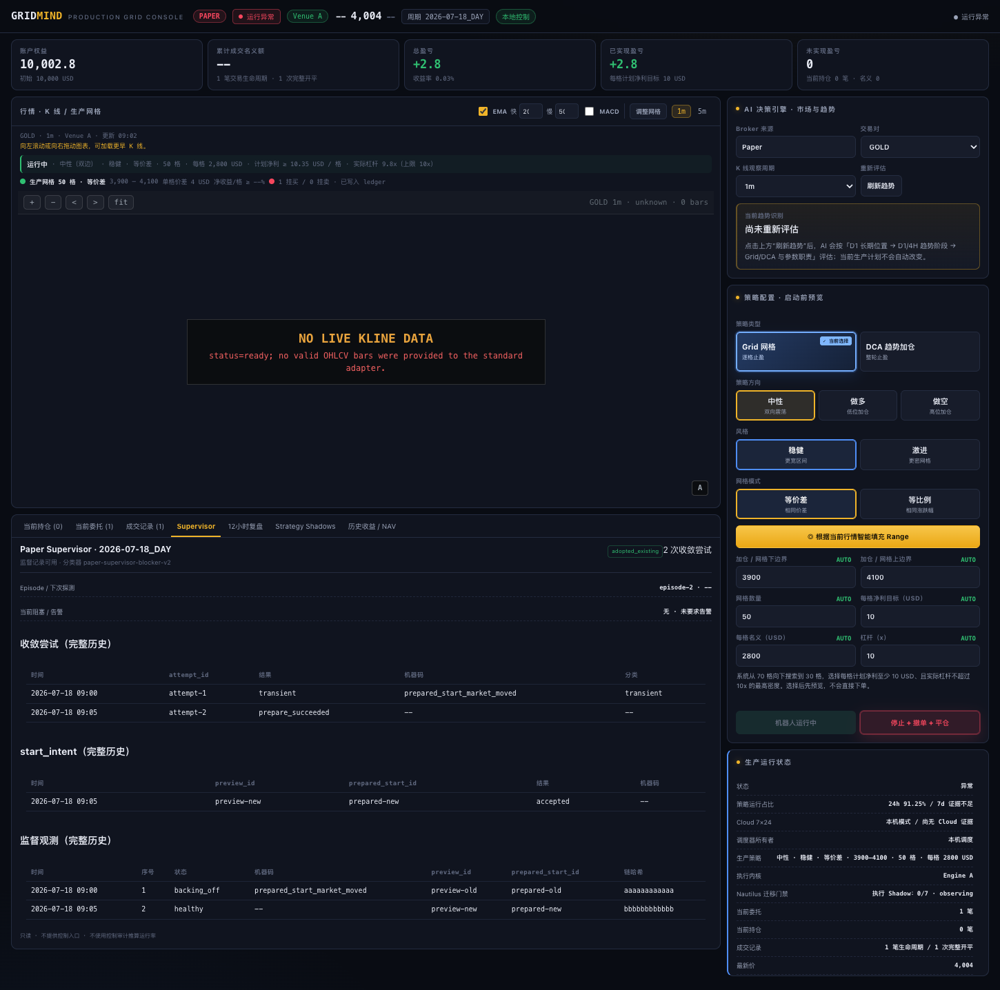

# Issue #467 — Supervisor read-model evidence

This evidence is code-complete proof only. It is not Cloud deployment proof and
does not satisfy the 48-hour Paper Supervisor acceptance criterion.

## User-visible result

The GridMind Supervisor tab shows:

- current-cycle convergence count and episode state;
- every pre-intent attempt with time, result, machine code and classification;
- every `start_intent` with its unique `preview_id` and `prepared_start_id`;
- every immutable observation with chain hash;
- 24h/7d utilization marked `insufficient` until the evidence window is
  complete.

## Safety assertions exercised

- Replaying the same fresh tick returns the original observation and creates no
  second start intent or order set.
- A crash after `tick_claimed` recovers with zero control calls before a later
  fresh tick may converge.
- Forged `running_proven=true` evidence is rejected on read.
- Missing, unknown, stale, cross-cycle and greater-than-120-second intervals
  count as zero.
- Accepted control events cannot create runtime utilization.
- A corrupt or concurrently incomplete observation source is explicitly
  unavailable and never projected as an empty healthy history.
