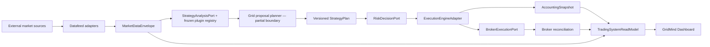

# Trading System Ports & Adapters Audit — 2026-07-18

## Executive answer

**Overall architecture progress: 86%**

`█████████████████▏░░ 86%`

The system now has a real hexagonal spine from trusted market facts through
StrategyPlan, Risk, Execution, Accounting, Broker, and the Dashboard read model.
Changing a data source, paper execution engine, or broker no longer requires
rewriting P&L, risk, or the UI.

It is not yet a full plug-and-play system. Signal analysis now resolves through
a frozen Strategy Plugin Registry, but the production grid proposal planner and
backtest selection still lack equivalent ports. Several proven compatibility
implementations also remain physically bundled with their ports.

This percentage measures modular architecture, not profitability, live-money
readiness, or whether the self-evolution loop has enough trades.

## How the score is calculated

Each row receives 0–25 for: versioned Contract, adapter Isolation, explicit
Composition, and conformance Proof plus intended production cutover. The total
is the arithmetic mean of the seven visible row totals: `600 / 7 = 85.7`,
rounded to `86%`.

| Product line | Contract | Isolation | Composition | Proof/cutover | Total |
|---|---:|---:|---:|---:|---:|
| Data download | 25 | 25 | 25 | 15 | 90 |
| Data cleaning / quality | 25 | 25 | 20 | 15 | 85 |
| Analysis / strategy | 25 | 20 | 20 | 20 | 85 |
| Backtest / replay | 20 | 20 | 15 | 15 | 70 |
| Live execution / broker | 25 | 20 | 20 | 20 | 85 |
| Risk / accounting / reconciliation | 25 | 20 | 20 | 25 | 90 |
| Dashboard / read model | 25 | 25 | 20 | 25 | 95 |

## Current end-to-end shape

Dependency direction is now mostly inward: adapters translate external facts
into stable contracts, while strategy/risk/accounting/read-model code consumes
those contracts. Concrete provider selection is allowed only at a composition
boundary. The exceptions are named below.

## Line-by-line audit

### 1. Data download — 90/100

- Port/contract: `MarketDataReadPort`, `TrustedMarketDataReadPort`, and
  `market-data-envelope-v1`.
- Adapter owner: the independent `/Users/wendy/datafeed` service owns upstream
  APIs, storage, normalization, sessions, cache, quality, and fallback policy.
- Composition: `market_data_repository()` is the sole production construction
  point; instrument routes select source adapters by config.
- Proof: strict mapper/envelope, source boundary, same-response parity, session,
  freshness, and failure-path suites.
- Remaining 10: current config still says
  `market_data_contract_mode=shadow`. V1 same-response parity passed, but real
  V2 session-aware parity has not yet justified authoritative cutover and
  removal of the `load_bars()` compatibility interpretation.

Swap truth: replacing Binance with Yahoo/FRED/Tiger is plug-compatible only
after the new datafeed adapter emits the same versioned envelope. Swapping a URL
without satisfying source, timeframe, OHLCV, session, freshness, and trust
validation is correctly rejected.

### 2. Data cleaning / quality — 85/100

- Contract/core: `Bar`, `MarketDataEnvelope`, and
  `datafeed_market_mapper.map_candle_response()` validate types, chronology,
  candle geometry, provider identity, requested source, synthetic state,
  session state, age, quality, and fallback policy atomically.
- Isolation: source cleaning belongs to datafeed adapters; the trading repo
  independently rechecks execution freshness at its consumer boundary.
- Proof: invalid/malformed/duplicate/out-of-order/session-closed fixtures fail
  closed; exact projection parity covers every safety field.
- Remaining 15: legacy list-of-`Bar` readers and some historical SQLite/data
  health compatibility seams remain frozen rather than deleted; production V2
  envelope authority is still shadow-gated.

### 3. Analysis / strategy — 85/100

- Contract: `strategy-analysis-plugin-v1` describes a provider-neutral
  `StrategyAnalysisPort`, stable plugin descriptors/capabilities, and one
  content fingerprint for the frozen startup registry. Signal output and the
  running grid's downstream `strategy-plan-v1` remain unchanged.
- Isolation/composition: MA, MACD, Chan, and every technical-rule name are lazy
  factories in `strategy_plugin_composition.py`. `Strategy`, the daily
  pipeline, runner, Lab, and backtest callers import no concrete engine to
  select an implementation.
- Cutover: the legacy global report cycle, enabled multi-strategy fleet, filters,
  and injected custom engines all resolve through the same registry. Missing
  `engine` explicitly means MA; empty, duplicate, unknown, late-mutated, or
  structurally invalid plugins fail closed. The runner exposes plugin audit
  evidence and skips unresolved strategies before their trading namespace is
  created.
- Proof: all 25 configured strategies resolve through 20 registered names;
  behavioral suites preserve MA/MACD/Chan/technical/filter results, custom
  injection, Lab replay, backtest, and runner behavior.
- Remaining 15: the production `DualTrackMachinePlanner` is still constructed
  directly by the cycle runner rather than through a proposal/planner port;
  `TechnicalRuleSignalEngine` and the small filter registry also retain
  internal family dispatch. Those are contained implementation seams, not
  application-level engine selection.

Conclusion: signal analysis is plug-compatible; production grid proposal
generation is the remaining partial strategy boundary.

### 4. Backtest / replay — 70/100

- Contracts: `BacktestEvidence`, normalized StrategyPlan commands, execution
  snapshots, and canonical AccountingSnapshot results.
- Mature path: Strategy Shadow delegates grid replay to Nautilus, binds exact
  runtime/code/fee/precision evidence, blocks look-ahead, and requires platform
  parity before promotion evidence is usable.
- Proof: ten execution classes, repeat/restart identity, fee/accounting parity,
  candidate conformance, and stale/tampered receipt rejection.
- Legacy caveat: `BacktestClient` still defaults to mock fallback and can turn
  signal strength/confidence into fabricated paper `BacktestEvidence` consumed
  by the legacy TradeTicket/reporting pipeline. The current authoritative
  DualTrack grid/Nautilus path does not consume that mock evidence and real
  money remains disabled, so this is not a live-capital safety defect; it does
  prevent awarding full production-cutover points to the system-wide row.
- Main gap: there is no formal Backtest Port. `BacktestClient` chooses remote,
  local, or mock behavior internally, while `LocalBacktester`,
  `strategy_backtester.py`, and Nautilus Shadow serve different research
  generations. Adding another backtest engine is not yet a registry-only act.

### 5. Live execution / broker — 85/100

- Ports: `ExecutionEngineAdapter`, `BrokerExecutionPort`, explicit broker
  capabilities, and a separate reconciliation port.
- Composition: Legacy/Nautilus paper selection is gated; `BrokerPluginRegistry`
  resolves `(mode, provider, environment)` and rejects unknown armed paths.
- Safety: risk, activation, preflight, reconciliation, attended approval,
  idempotency, ambiguous-submit recovery, protective orders, and reduce-only
  exits remain additive.
- Remaining 15:
  - `dualtrack_execution_adapter.py` contains both the protocol, Legacy
    implementation, and hard-coded Legacy/Nautilus factory instead of a pure
    execution plugin registry.
  - the large `LiveBrokerAdapter` compatibility class still owns several venue
    wire implementations; adding a broker is registered, but physical isolation
    is incomplete.
  - configured Nautilus authority is paper-only and attended; real-money
    eligibility remains correctly false. That is an operational gate, not an
    architecture failure, but it prevents claiming full cutover proof.

### 6. Risk / accounting / reconciliation — 90/100

- Risk: `risk-request-v1` and `risk-decision-v1` bind exact plan commands,
  trusted market, canonical account, current execution, policy, and evaluator
  identity. Every exposure-increasing mutation rechecks under the command lock.
- Accounting: `accounting-snapshot-v1` is the only P&L/count/account truth for
  Legacy, Nautilus, production history, and broker observations. Unknown venue
  facts remain `None`, never fabricated zeroes.
- Reconciliation: execution and broker truth are compared explicitly; stale or
  drifted evidence cannot authorize money.
- Main gap: `accounting_projection.py` is pure, but Binance and Tiger broker
  normalization still branch inside that same module. The contract is stable;
  the provider mappers have not yet been extracted into registered accounting
  adapters. Risk evaluator/store responsibilities also share one module.

### 7. Dashboard / read model — 95/100

- Contract: GridMind consumes one immutable
  `trading-system-read-model-v1` with content-bound source identities and
  explicit current-cycle versus production-history scopes.
- Isolation: GET paths do not create plans, evaluate exits, mark P&L, call
  broker preflight, or write trading state. The browser formats backend truth
  and does not calculate P&L, return, counts, grid spacing, strategy mode,
  provider, or engine selection.
- Proof: durable filesystem fingerprints, deterministic snapshot identity,
  safe POST-to-GET integration, static arithmetic/provider guards, and desktop
  plus mobile browser acceptance.
- Remaining 5: legacy Dashboard/facade endpoints remain for compatibility and
  some old surfaces still have their own presentation models. They no longer
  own command or accounting authority but have not been retired.

## What is genuinely plug-and-play today

| Replacement | Current answer | Required work |
|---|---|---|
| Market data provider | Yes, behind datafeed | Implement one datafeed adapter and pass the envelope conformance suite |
| Paper execution engine | Mostly | Implement `ExecutionEngineAdapter`, exact accounting/conformance, then pass attended cutover gates |
| Broker / venue | Yes at application boundary | Register execution + reconciliation plugins and pass venue/lifecycle/protection tests |
| Risk policy evaluator | Yes for normalized requests | Implement `RiskDecisionPort`; preserve mutation-time identity and exit availability |
| Dashboard client | Yes | Consume `trading-system-read-model-v1`; commands remain separate POSTs |
| Strategy analysis engine | Yes | Implement `StrategyAnalysisPort`, explicitly register before startup freeze, and pass behavior/replay tests |
| Production grid proposal planner | Not yet | Extract `DualTrackMachinePlanner` behind a versioned proposal/planner port and explicit composition root |
| Backtest engine | Not yet | Must still edit `BacktestClient`/pipeline composition |

## Self-repair and self-evolution are separate axes

### System self-repair readiness — 58%

The system has strong sensing and safe blocking: health checks, source
preflight, runner status, reconciliation, restart/ambiguous-order recovery,
kill switches, alerts, and idempotent commands. It does not yet have one
normalized `Diagnosis -> RepairPlan -> Actuator -> Verification -> Rollback`
port. Repair actions are spread across supervisors, scripts, and attended
runbooks. Therefore it can detect many failures and recover a subset, but it is
not a general self-healing closed loop.

### Grid strategy self-evolution readiness — 62%

Strategy Shadows, immutable plans, causal replay boundaries, review records,
sample gates, and manual promotion locks are in place. The system correctly
refuses to promote thin evidence. What is still missing is one portfolio of
5–10 concurrently versioned What-if challengers, a persistent causal
explanation contract, regime-aware out-of-sample comparison, and a promotion
decision based on at least the required trade sample (preferably 100) without
silently changing production. This is a safe partial loop, not true autonomous
evolution yet.

## Shortest remaining architecture backlog

1. **Strategy proposal/planner port (medium):** keep `strategy-plan-v1`, move
   `DualTrackMachinePlanner` construction out of the cycle runner, and register
   deterministic/manual/AI proposal implementations with identical validation
   and provenance evidence.
2. **Backtest composition (medium):** define a Backtest Port over versioned
   scenario + normalized result; register Nautilus, local research, and remote
   implementations; remove mock fallback from every execution-eligible legacy
   paper path before that family can ever be promoted. The current authoritative
   DualTrack/Nautilus grid path is already independent of this fallback.
3. **Execution plugin registry (medium):** move the protocol out of
   `dualtrack_execution_adapter.py`; register Legacy/Nautilus/Shadow factories
   without an engine-name branch in the application module.
4. **Accounting adapter extraction (medium):** keep
   `accounting-snapshot-v1`, move broker-specific mappings out of
   `accounting_projection.py`, and register them by source contract.
5. **Venue package strangler (large but incremental):** move Binance, Tiger,
   OANDA, and MT5 networking out of `LiveBrokerAdapter` one adapter at a time;
   retain the compatibility facade until every venue passes the same suite.
6. **Market Envelope V2 cutover (small after evidence):** capture real
   session-aware same-response parity, switch authority explicitly, then delete
   the duplicate `load_bars()` interpretation and narrow SQLite seams.
7. **Legacy read-surface retirement (medium):** migrate remaining consumers to
   the stable read model, announce deprecation, then remove facade-only
   presentation code.

## Final judgment

The architecture is now strong enough that self-repair and grid evolution can
be built without reworking market, execution, risk, accounting, broker, and UI
truth again. A new signal-analysis engine can now be dropped in without editing
application code. A new production grid planner or backtester cannot yet make
that claim. The honest state is a robust hexagonal spine with a completed
signal-plugin boundary, two weaker upper-layer planning/replay boundaries, and
several contained compatibility monoliths.

For the grid-only product focus, the next highest-leverage change is the
Strategy proposal/planner port, followed by Backtest composition—not another
Dashboard or provider-specific integration.
