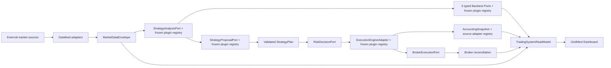

# Trading System Ports & Adapters Audit — 2026-07-18

## Executive answer

**Overall architecture progress: 92%**

`██████████████████▍░ 92%`

The system now has a real hexagonal spine from trusted market facts through
StrategyPlan, Risk, Execution, Accounting, Broker, and the Dashboard read model.
Changing a data source, paper execution engine, or broker no longer requires
rewriting P&L, risk, or the UI.

It is not yet a full plug-and-play system. Signal analysis, production grid
proposal generation, all three backtest use cases, paper execution, and broker
accounting normalization now resolve through frozen plugin registries. The
largest remaining gaps are completion of the venue-adapter strangler, the
authoritative Market Envelope V2 cutover, and physical risk evaluator/store
separation.

This percentage measures modular architecture, not profitability, live-money
readiness, or whether the self-evolution loop has enough trades.

## How the score is calculated

Each row receives 0–25 for: versioned Contract, adapter Isolation, explicit
Composition, and conformance Proof plus intended production cutover. The total
is the rounded arithmetic mean of the seven visible row totals:
`644 / 7 = 92.0%`, reported as `92%`.

| Product line | Contract | Isolation | Composition | Proof/cutover | Total |
|---|---:|---:|---:|---:|---:|
| Data download | 25 | 25 | 25 | 15 | 90 |
| Data cleaning / quality | 25 | 25 | 20 | 15 | 85 |
| Analysis / strategy | 25 | 20 | 25 | 25 | 95 |
| Backtest / replay | 25 | 20 | 25 | 20 | 90 |
| Live execution / broker | 25 | 24 | 25 | 20 | 94 |
| Risk / accounting / reconciliation | 25 | 20 | 25 | 25 | 95 |
| Dashboard / read model | 25 | 25 | 20 | 25 | 95 |

## Current end-to-end shape

Dependency direction is now mostly inward: adapters translate external facts
into stable contracts, while strategy/risk/accounting/read-model code consumes
those contracts. Concrete provider selection is allowed only at a composition
boundary. The exceptions are named below.

## Line-by-line audit

### 1. Data download — 90/100

- Port/contract: `MarketDataReadPort`, `TrustedMarketDataReadPort`, and
  `market-data-envelope-v1`.
- Adapter owner: the independent `/Users/wendy/datafeed` service owns upstream
  APIs, storage, normalization, sessions, cache, quality, and fallback policy.
- Composition: `market_data_repository()` is the sole production construction
  point; instrument routes select source adapters by config.
- Proof: strict mapper/envelope, source boundary, same-response parity, session,
  freshness, and failure-path suites.
- Remaining 10: current config still says
  `market_data_contract_mode=shadow`. V1 same-response parity passed, but real
  V2 session-aware parity has not yet justified authoritative cutover and
  removal of the `load_bars()` compatibility interpretation.

Swap truth: replacing Binance with Yahoo/FRED/Tiger is plug-compatible only
after the new datafeed adapter emits the same versioned envelope. Swapping a URL
without satisfying source, timeframe, OHLCV, session, freshness, and trust
validation is correctly rejected.

### 2. Data cleaning / quality — 85/100

- Contract/core: `Bar`, `MarketDataEnvelope`, and
  `datafeed_market_mapper.map_candle_response()` validate types, chronology,
  candle geometry, provider identity, requested source, synthetic state,
  session state, age, quality, and fallback policy atomically.
- Isolation: source cleaning belongs to datafeed adapters; the trading repo
  independently rechecks execution freshness at its consumer boundary.
- Proof: invalid/malformed/duplicate/out-of-order/session-closed fixtures fail
  closed; exact projection parity covers every safety field.
- Remaining 15: legacy list-of-`Bar` readers and some historical SQLite/data
  health compatibility seams remain frozen rather than deleted; production V2
  envelope authority is still shadow-gated.

### 3. Analysis / strategy — 95/100

- Contracts: `strategy-analysis-plugin-v1` describes provider-neutral signal
  engines. `strategy-proposal-request-v1` gives production grid planners a
  bounded, deeply immutable market/review/volatility/replan/research context;
  `strategy-proposal-plugin-v1` binds safe provenance and required context.
  Both startup registries publish stable descriptors and content fingerprints.
- Isolation/composition: MA, MACD, Chan, and every technical-rule name are lazy
  factories in `strategy_plugin_composition.py`. `Strategy`, the daily
  pipeline, runner, Lab, and backtest callers import no concrete engine to
  select an implementation. `DualTrackCycleRunner` composes one frozen proposal
  runtime before creating stores or execution services; the trusted planner core
  imports no Codex adapter and retains range-floor policy, validation, degraded
  no-trade fallback, persistence, revisions, traces, and audit. Proposal output
  is copied through a field allowlist, so plugins cannot forge lifecycle,
  provenance, revision, or fallback metadata.
- Cutover: the configured `codex_newsletter` adapter preserves the exact prompt
  and read-only/ephemeral subprocess restrictions. A deterministic planner can
  replace it by registry selection without editing the runner or core. Missing
  legacy engine names still mean MA; explicit empty, duplicate, unknown,
  late-mutated, invalid factory products, and invalid proposal results all fail
  closed. Unknown configured proposal names are rejected before trading
  artifacts exist.
- Proof: all 25 signal strategies resolve through 20 names. Proposal acceptance
  additionally covers deeply immutable input, byte-identical legacy prompt,
  custom provider-free `pre_cycle`, least-privilege newsletter context, safe
  audit fingerprint, hostile reserved-field injection, degraded initial
  failure, and preserved locked plan on forced replan failure.
- Remaining 5: `TechnicalRuleSignalEngine` and the small filter registry retain
  internal family dispatch. These are contained implementation seams, not
  application-level engine or production-planner selection.

Conclusion: signal analysis and production grid proposal generation are now
plug-compatible while plan safety remains invariant across plugins.

### 4. Backtest / replay — 90/100

- Contracts: `signal-backtest-request-v1` and
  `historical-strategy-backtest-request-v1` are deeply immutable and
  content-hashed. `SignalBacktestPort`, `HistoricalStrategyBacktestPort`, and
  `StrategyShadowReplayPort` keep three genuinely different semantics instead
  of hiding them behind `run(dict)`. `backtest-evidence-v2` binds plugin,
  evidence tier, input identity, registry fingerprint, degradation, and source
  eligibility for promotion.
- Isolation/composition: Local signal evidence, remote signal evidence,
  synthetic context, event-driven historical ranking, and Nautilus Strategy
  Shadow are five explicit adapters in one kind-aware frozen registry. Daily,
  the historical leaderboard, the parameter experiment queue, and Strategy
  Shadow import no concrete backtest engine and reject unknown, empty,
  wrong-kind, late-mutated, or invalid plugin selections before output.
- Cutover: production Daily explicitly selects `local_signal`; it no longer
  reads `local_backtest_enabled` or routes backtest failure through
  `analysis_fallback_to_mock`. Empty history remains transparent `thin` evidence
  and cannot fall through to remote or synthetic samples. Synthetic context is
  available only by the explicit `synthetic_signal_context` name, always marked
  degraded and promotion-ineligible. Historical ranking and Strategy Shadow
  preserve their existing simulation/replay behavior apart from additive,
  content-bound plugin audit fields. The paper-only parameter experiment queue
  now sends each variant's exact stop/target/hold/verdict config through the
  same signal port instead of constructing `LocalBacktester` directly.
- Safety/proof: core normalization rejects identity mismatch, unknown verdicts,
  negative/non-finite metrics, invalid result shapes, and plugin attempts to
  overwrite provenance or report identity. Strategy Shadow still requires
  causal boundaries, runtime/code/fee/precision evidence, accounting
  reconciliation, non-authoritative storage, and platform parity; a plugin
  descriptor grants no execution or promotion authority.
- Remaining 10: `BacktestClient` remains as a legacy compatibility facade and
  intentionally retains its explicit remote-to-synthetic fallback for old
  callers. No production application imports it, but its retirement and the
  migration of legacy evidence readers remain contained cleanup debt.

### 5. Live execution / broker — 94/100

- Ports: the provider-free `ExecutionEngineAdapter`, `BrokerExecutionPort`,
  explicit broker capabilities, and a separate reconciliation port.
- Isolation/composition: Legacy, Nautilus, and non-authoritative Shadowing live
  in separate adapter modules. One explicit frozen execution registry publishes
  role/capability/paper-only descriptors plus a stable fingerprint. Production
  runner, Dashboard commands, control plane, and attended cutover resolve only
  through the trusted composition root. `dualtrack_execution_adapter.py` is now
  a re-export-only compatibility facade with no selection or execution logic.
  `BrokerPluginRegistry` separately resolves `(mode, provider, environment)`
  and rejects unknown armed paths. Binance USD-M base URL/instrument mapping,
  immutable endpoint catalog, public ExchangeInfo normalization, credentials,
  HMAC signing, request construction, timeout, and response decoding now live
  in the venue-owned `services/venues/binance_usdm_transport.py`. OANDA REST
  credentials, endpoint/instrument selection, payload translation, HTTP,
  response mapping, and durable recording now live in its concrete adapter;
  MT5 outbox/inbox, templates, executable-intent creation, and receipt
  correlation live in a separate filesystem adapter. Both are selected
  directly by the registry. The legacy class retains only thin compatibility
  delegates for OANDA/MT5 and existing Binance demo, testnet, mainnet, canary,
  and kill-switch call seams.
- Safety: risk, activation, preflight, reconciliation, attended approval,
  seven-cycle/parity gates, exact override acknowledgement, isolated-runtime
  requirements, idempotency, ambiguous-submit recovery, protective orders, and
  reduce-only exits remain core-owned and additive. A custom provider-free
  paper engine can be registered without editing an application module; config
  cannot grant real-money or cutover authority. The public ExchangeInfo request
  is proven credential-free; missing/placeholder credentials block signed I/O
  before the opener is called.
- Remaining 6:
  - `LiveBrokerAdapter` still owns Binance order lifecycle/payload/protection
    policy plus Tiger/manual compatibility behavior. Binance wire I/O and the
    complete OANDA/MT5 implementations are isolated, but full concrete
    venue-adapter extraction is incomplete.
  - configured Nautilus authority is paper-only and attended; real-money
    eligibility remains correctly false. That is an operational gate, not an
    architecture failure, but it prevents claiming full cutover proof.

### 6. Risk / accounting / reconciliation — 95/100

- Risk: `risk-request-v1` and `risk-decision-v1` bind exact plan commands,
  trusted market, canonical account, current execution, policy, and evaluator
  identity. Every exposure-increasing mutation rechecks under the command lock.
- Accounting: `accounting-snapshot-v1` is the only P&L/count/account truth for
  Legacy, Nautilus, production history, and broker observations. The
  provider-free execution projector and immutable snapshot contract import no
  venue adapter. Binance USD-M and Tiger aggregate-account mappings live in
  separate read-only adapters behind one frozen source registry with aliases,
  source schemas, stable fingerprint, runtime identity checks, and exact result
  validation. Unknown venue facts remain `None`, never fabricated zeroes.
- Composition/cutover: execution consumers import only the provider-free core;
  reconciliation and Tiger sync import only the broker accounting composition
  root. `accounting_projection.py` is a re-export-only compatibility facade.
  A custom source adapter can be registered without editing risk, Dashboard,
  execution, or reconciliation modules. Frozen A11 snapshot IDs prove the
  Binance and Tiger economic payloads did not change.
- Reconciliation: execution and broker truth are compared explicitly; stale or
  drifted evidence cannot authorize money.
- Remaining 5: risk evaluator and decision-store responsibilities still share
  one module. Their public port and content-bound decision contract are stable,
  but physical policy/store composition has not yet been extracted.

### 7. Dashboard / read model — 95/100

- Contract: GridMind consumes one immutable
  `trading-system-read-model-v1` with content-bound source identities and
  explicit current-cycle versus production-history scopes.
- Isolation: GET paths do not create plans, evaluate exits, mark P&L, call
  broker preflight, or write trading state. The browser formats backend truth
  and does not calculate P&L, return, counts, grid spacing, strategy mode,
  provider, or engine selection.
- Proof: durable filesystem fingerprints, deterministic snapshot identity,
  safe POST-to-GET integration, static arithmetic/provider guards, and desktop
  plus mobile browser acceptance.
- Remaining 5: legacy Dashboard/facade endpoints remain for compatibility and
  some old surfaces still have their own presentation models. They no longer
  own command or accounting authority but have not been retired.

## What is genuinely plug-and-play today

| Replacement | Current answer | Required work |
|---|---|---|
| Market data provider | Yes, behind datafeed | Implement one datafeed adapter and pass the envelope conformance suite |
| Paper execution engine | Yes | Implement and register `ExecutionEngineAdapter`, pass exact accounting/conformance, then satisfy attended cutover gates |
| Broker / venue | Yes at application boundary | Register execution + reconciliation plugins and pass venue/lifecycle/protection tests |
| Broker accounting source | Yes | Register one read-only projection adapter and pass exact snapshot/completeness/reconciliation conformance |
| Risk policy evaluator | Yes for normalized requests | Implement `RiskDecisionPort`; preserve mutation-time identity and exit availability |
| Dashboard client | Yes | Consume `trading-system-read-model-v1`; commands remain separate POSTs |
| Strategy analysis engine | Yes | Implement `StrategyAnalysisPort`, explicitly register before startup freeze, and pass behavior/replay tests |
| Production grid proposal planner | Yes | Implement `StrategyProposalPort`, explicitly register before startup freeze, declare required context, and pass core validation/failure conformance |
| Backtest engine | Yes by use-case | Register the matching signal, historical-ranking, or Strategy Shadow adapter and pass its typed conformance suite |

## Self-repair and self-evolution are separate axes

### System self-repair readiness — 58%

The system has strong sensing and safe blocking: health checks, source
preflight, runner status, reconciliation, restart/ambiguous-order recovery,
kill switches, alerts, and idempotent commands. It does not yet have one
normalized `Diagnosis -> RepairPlan -> Actuator -> Verification -> Rollback`
port. Repair actions are spread across supervisors, scripts, and attended
runbooks. Therefore it can detect many failures and recover a subset, but it is
not a general self-healing closed loop.

### Grid strategy self-evolution readiness — 62%

Strategy Shadows, immutable plans, causal replay boundaries, review records,
sample gates, and manual promotion locks are in place. The system correctly
refuses to promote thin evidence. What is still missing is one portfolio of
5–10 concurrently versioned What-if challengers, a persistent causal
explanation contract, regime-aware out-of-sample comparison, and a promotion
decision based on at least the required trade sample (preferably 100) without
silently changing production. This is a safe partial loop, not true autonomous
evolution yet.

## Shortest remaining architecture backlog

1. **Venue package strangler (large but incremental):** Binance wire transport
   and the complete OANDA/MT5 adapters are now venue-owned. Move the remaining
   Binance lifecycle/protection body and Tiger implementation out of
   `LiveBrokerAdapter`; retain the facade until every venue passes the same
   suite.
2. **Market Envelope V2 cutover (small after evidence):** capture real
   session-aware same-response parity, switch authority explicitly, then delete
   the duplicate `load_bars()` interpretation and narrow SQLite seams.
3. **Risk policy/store extraction (medium):** keep `risk-request-v1` and
   `risk-decision-v1`, register policy evaluators explicitly, and separate
   immutable decision persistence from evaluation.
4. **Legacy read-surface retirement (medium):** migrate remaining consumers to
   the stable read model, announce deprecation, then remove facade-only
   presentation code.
5. **Backtest compatibility retirement (small):** migrate remaining direct
   `BacktestClient` callers to explicit plugins, then delete its fallback branch
   and narrow legacy `BacktestEvidence` readers to the V2 provenance contract.

## Final judgment

The architecture is now strong enough that self-repair and grid evolution can
be built without reworking market, strategy, backtest, risk, accounting, broker,
and UI truth again. A new signal engine, production grid planner, signal
backtester, historical ranker, Strategy Shadow replay, paper execution engine,
or broker accounting source can be registered without editing its application
pipeline. The honest state is a robust hexagonal spine with several contained
compatibility monoliths still awaiting physical extraction.

For the grid-only product focus, the next highest-leverage architecture change
is finishing incremental venue-adapter isolation, followed by the
evidence-gated Market Envelope V2 cutover—not another Dashboard or
provider-specific integration.
